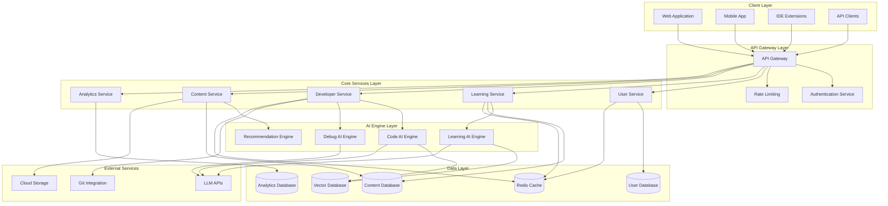

# Design Document: AI-based Learning and Developer Productivity System

## Overview

The AI-based Learning and Developer Productivity System is designed as a modular, cloud-native platform that leverages machine learning and natural language processing to provide personalized learning experiences and intelligent developer assistance. The system employs a microservices architecture with dedicated AI engines for different domains (learning, coding, debugging) while maintaining a unified user experience through a central orchestration layer.

The platform integrates multiple AI models including large language models for code generation, recommendation engines for personalized learning paths, and analytical models for productivity insights. The design emphasizes scalability, real-time responsiveness, and adaptive learning capabilities.

## Architecture

### High-Level Architecture



### Service Architecture Patterns

**Microservices Pattern**: Each core domain (learning, development, content, analytics) is implemented as an independent service with its own database and AI engine.

**Event-Driven Architecture**: Services communicate through asynchronous events for real-time updates and loose coupling.

**CQRS (Command Query Responsibility Segregation)**: Separate read and write models for optimal performance, especially for analytics and reporting.

**Circuit Breaker Pattern**: Resilience against AI service failures with graceful degradation.

## Components and Interfaces

### Core Services

#### User Service
**Responsibilities:**
- User authentication and authorization
- Profile management and preferences
- Cross-service user context management

**Key Interfaces:**
```typescript
interface UserService {
  authenticateUser(credentials: LoginCredentials): Promise<AuthToken>
  getUserProfile(userId: string): Promise<UserProfile>
  updateLearningPreferences(userId: string, preferences: LearningPreferences): Promise<void>
  getDeveloperSettings(userId: string): Promise<DeveloperSettings>
}

interface UserProfile {
  userId: string
  email: string
  role: UserRole
  learningPreferences: LearningPreferences
  developerSettings: DeveloperSettings
  createdAt: Date
  lastActive: Date
}
```

#### Learning Service
**Responsibilities:**
- Learning path generation and management
- Progress tracking and assessment
- Adaptive content delivery

**Key Interfaces:**
```typescript
interface LearningService {
  generateLearningPath(userId: string, goals: LearningGoals): Promise<LearningPath>
  trackProgress(userId: string, activityId: string, progress: ProgressData): Promise<void>
  getPersonalizedContent(userId: string, topic: string): Promise<ContentItem[]>
  assessKnowledge(userId: string, assessment: Assessment): Promise<AssessmentResult>
}

interface LearningPath {
  pathId: string
  userId: string
  goals: LearningGoals
  modules: LearningModule[]
  estimatedDuration: number
  difficulty: DifficultyLevel
  prerequisites: string[]
}
```

#### Developer Service
**Responsibilities:**
- Code assistance and suggestions
- Debugging support and analysis
- Productivity metrics tracking

**Key Interfaces:**
```typescript
interface DeveloperService {
  getCodeSuggestions(context: CodeContext): Promise<CodeSuggestion[]>
  analyzeCode(code: string, language: string): Promise<CodeAnalysis>
  debugAssistance(error: ErrorContext): Promise<DebugSuggestion[]>
  trackProductivity(userId: string, activity: DeveloperActivity): Promise<void>
}

interface CodeSuggestion {
  suggestionId: string
  type: SuggestionType
  code: string
  explanation: string
  confidence: number
  applicableRange: CodeRange
}
```

#### Content Service
**Responsibilities:**
- Content management and curation
- Recommendation engine integration
- Content versioning and delivery

**Key Interfaces:**
```typescript
interface ContentService {
  searchContent(query: SearchQuery): Promise<ContentSearchResult>
  getRecommendations(userId: string, context: RecommendationContext): Promise<ContentItem[]>
  createContent(content: ContentCreationRequest): Promise<ContentItem>
  updateContent(contentId: string, updates: ContentUpdate): Promise<ContentItem>
}

interface ContentItem {
  contentId: string
  title: string
  type: ContentType
  difficulty: DifficultyLevel
  tags: string[]
  content: string
  metadata: ContentMetadata
  createdAt: Date
  updatedAt: Date
}
```

#### Analytics Service
**Responsibilities:**
- Learning analytics and insights
- Productivity metrics calculation
- Performance reporting

**Key Interfaces:**
```typescript
interface AnalyticsService {
  generateLearningReport(userId: string, timeframe: TimeFrame): Promise<LearningReport>
  getProductivityMetrics(userId: string, timeframe: TimeFrame): Promise<ProductivityMetrics>
  trackUserBehavior(userId: string, event: UserEvent): Promise<void>
  generateInsights(userId: string): Promise<PersonalizedInsights>
}

interface ProductivityMetrics {
  userId: string
  timeframe: TimeFrame
  codingSpeed: number
  errorRate: number
  taskCompletionRate: number
  focusTime: number
  improvementSuggestions: string[]
}
```

### AI Engine Components

#### Learning AI Engine
**Responsibilities:**
- Personalized learning path generation
- Knowledge assessment and gap analysis
- Adaptive content recommendation

**Core Algorithms:**
- Collaborative filtering for content recommendation
- Knowledge graph traversal for learning path optimization
- Natural language processing for content understanding
- Reinforcement learning for adaptive difficulty adjustment

#### Code AI Engine
**Responsibilities:**
- Context-aware code completion
- Code quality analysis and suggestions
- Pattern recognition and best practice enforcement

**Core Algorithms:**
- Transformer-based code generation models
- Abstract syntax tree analysis
- Static code analysis with ML enhancement
- Code similarity detection and pattern matching

#### Debug AI Engine
**Responsibilities:**
- Error pattern recognition and classification
- Solution suggestion based on historical data
- Root cause analysis assistance

**Core Algorithms:**
- Error classification using supervised learning
- Solution ranking based on success rates
- Code flow analysis for logical error detection
- Anomaly detection in execution patterns

## Data Models

### User Domain Models

```typescript
interface User {
  userId: string
  email: string
  passwordHash: string
  role: UserRole
  profile: UserProfile
  preferences: UserPreferences
  createdAt: Date
  updatedAt: Date
  lastLoginAt: Date
}

interface UserPreferences {
  learningStyle: LearningStyle
  preferredLanguages: string[]
  difficultyPreference: DifficultyLevel
  notificationSettings: NotificationSettings
  privacySettings: PrivacySettings
}

enum UserRole {
  STUDENT = "student",
  DEVELOPER = "developer",
  EDUCATOR = "educator",
  ADMIN = "admin"
}

enum LearningStyle {
  VISUAL = "visual",
  AUDITORY = "auditory",
  KINESTHETIC = "kinesthetic",
  READING_WRITING = "reading_writing"
}
```

### Learning Domain Models

```typescript
interface LearningModule {
  moduleId: string
  title: string
  description: string
  objectives: LearningObjective[]
  content: ContentItem[]
  assessments: Assessment[]
  prerequisites: string[]
  estimatedDuration: number
  difficulty: DifficultyLevel
}

interface LearningObjective {
  objectiveId: string
  description: string
  bloomsLevel: BloomsLevel
  measurable: boolean
  assessmentCriteria: string[]
}

interface ProgressRecord {
  userId: string
  moduleId: string
  contentId: string
  status: ProgressStatus
  score: number
  timeSpent: number
  completedAt: Date
  attempts: number
}

enum ProgressStatus {
  NOT_STARTED = "not_started",
  IN_PROGRESS = "in_progress",
  COMPLETED = "completed",
  MASTERED = "mastered"
}
```

### Developer Domain Models

```typescript
interface CodeProject {
  projectId: string
  userId: string
  name: string
  description: string
  language: string
  framework: string
  repository: RepositoryInfo
  settings: ProjectSettings
  createdAt: Date
  updatedAt: Date
}

interface CodeSession {
  sessionId: string
  userId: string
  projectId: string
  startTime: Date
  endTime: Date
  filesModified: string[]
  linesAdded: number
  linesDeleted: number
  errorsEncountered: ErrorRecord[]
  productivityScore: number
}

interface ErrorRecord {
  errorId: string
  sessionId: string
  errorType: string
  errorMessage: string
  stackTrace: string
  fileName: string
  lineNumber: number
  resolved: boolean
  resolutionTime: number
  aiSuggestionUsed: boolean
}
```

### Content Domain Models

```typescript
interface ContentMetadata {
  author: string
  version: string
  language: string
  framework?: string
  difficulty: DifficultyLevel
  estimatedReadTime: number
  prerequisites: string[]
  learningObjectives: string[]
  tags: string[]
}

interface ContentVersion {
  versionId: string
  contentId: string
  version: string
  content: string
  changelog: string
  createdBy: string
  createdAt: Date
  approved: boolean
}

enum ContentType {
  TUTORIAL = "tutorial",
  EXERCISE = "exercise",
  REFERENCE = "reference",
  EXAMPLE = "example",
  ASSESSMENT = "assessment",
  VIDEO = "video",
  INTERACTIVE = "interactive"
}
```

### Analytics Domain Models

```typescript
interface LearningAnalytics {
  userId: string
  timeframe: TimeFrame
  modulesCompleted: number
  averageScore: number
  timeSpent: number
  streakDays: number
  knowledgeGaps: string[]
  strongAreas: string[]
  recommendedActions: string[]
}

interface DeveloperAnalytics {
  userId: string
  timeframe: TimeFrame
  linesOfCode: number
  commitsCount: number
  averageSessionLength: number
  errorRate: number
  codeQualityScore: number
  productivityTrend: TrendData[]
  topLanguages: LanguageUsage[]
}

interface TrendData {
  date: Date
  value: number
  metric: string
}
```

## Error Handling

### Error Classification System

**Client Errors (4xx)**:
- `400 Bad Request`: Invalid input parameters or malformed requests
- `401 Unauthorized`: Authentication required or invalid credentials
- `403 Forbidden`: Insufficient permissions for requested operation
- `404 Not Found`: Requested resource does not exist
- `429 Too Many Requests`: Rate limit exceeded

**Server Errors (5xx)**:
- `500 Internal Server Error`: Unexpected server-side errors
- `502 Bad Gateway`: AI service unavailable or timeout
- `503 Service Unavailable`: Temporary service overload
- `504 Gateway Timeout`: AI processing timeout

### AI Service Error Handling

**Graceful Degradation Strategy**:
- When AI services are unavailable, fall back to rule-based alternatives
- Cache recent AI responses for offline functionality
- Provide manual alternatives for critical features
- Queue requests for retry when services recover

**Error Recovery Patterns**:
```typescript
interface AIServiceError {
  errorCode: string
  message: string
  retryable: boolean
  fallbackAvailable: boolean
  estimatedRecoveryTime: number
}

interface ErrorRecoveryStrategy {
  maxRetries: number
  backoffStrategy: BackoffStrategy
  fallbackService?: string
  cacheStrategy: CacheStrategy
}
```

### Data Consistency and Validation

**Input Validation**:
- Schema validation for all API inputs
- Sanitization of user-generated content
- Rate limiting and abuse prevention
- Content moderation for collaborative features

**Data Integrity**:
- Transactional operations for critical data updates
- Event sourcing for audit trails
- Eventual consistency for cross-service operations
- Conflict resolution for concurrent updates

## Testing Strategy

### Dual Testing Approach

The system requires both unit testing and property-based testing to ensure comprehensive coverage and correctness.

**Unit Testing Focus**:
- API endpoint validation with specific request/response examples
- Database operation verification with known data sets
- Authentication and authorization edge cases
- Error handling scenarios with specific error conditions
- Integration points between services with mock data

**Property-Based Testing Focus**:
- Universal properties that must hold across all valid inputs
- AI model behavior consistency across different contexts
- Data transformation invariants (serialization, caching)
- User workflow correctness across different user types
- System performance characteristics under varying loads

**Testing Configuration**:
- Property tests: minimum 100 iterations per test
- Unit tests: comprehensive coverage of edge cases and error conditions
- Integration tests: end-to-end workflow validation
- Performance tests: load testing with realistic user patterns
- Security tests: penetration testing and vulnerability assessment

**Property-Based Testing Library**: 
- **TypeScript/JavaScript**: fast-check
- **Python**: Hypothesis
- **Java**: jqwik
- **Go**: gopter

Each property test must be tagged with: **Feature: ai-learning-productivity-system, Property {number}: {property_text}**

The testing strategy emphasizes early detection of correctness issues through property-based testing while using unit tests to validate specific business logic and integration scenarios.

## Correctness Properties

*A property is a characteristic or behavior that should hold true across all valid executions of a system—essentially, a formal statement about what the system should do. Properties serve as the bridge between human-readable specifications and machine-verifiable correctness guarantees.*

### Property 1: Learning Assessment and Adaptation
*For any* student account creation or learning engagement, the system should assess knowledge levels, generate appropriate learning paths, and continuously adapt content difficulty based on demonstrated understanding.
**Validates: Requirements 1.1, 1.2, 8.1, 8.4, 8.5**

### Property 2: Progress Tracking Consistency
*For any* learning activity completion, progress updates, or device synchronization, the system should maintain consistent progress records and ensure all learning positions are preserved across sessions and devices.
**Validates: Requirements 1.3, 6.1, 6.2, 6.4**

### Property 3: Intelligent Content Recommendation
*For any* content search, learning objective, or knowledge gap identification, the system should provide relevant, personalized recommendations that align with the user's current learning path and goals.
**Validates: Requirements 1.2, 4.1, 4.5, 8.3**

### Property 4: Adaptive Learning Support
*For any* indication of student struggle or mastery demonstration, the system should provide appropriate alternative explanations for difficulties and advance to challenging content for mastered topics.
**Validates: Requirements 1.4, 1.5**

### Property 5: Code Assistance and Quality Analysis
*For any* code file opening, typing, or saving, the system should provide contextually relevant suggestions, real-time completions, and comprehensive quality analysis with optimization recommendations.
**Validates: Requirements 2.1, 2.2, 2.3, 2.5, 9.1, 9.2, 9.4**

### Property 6: Technology Adaptation
*For any* new technology or framework usage, the system should adapt its suggestions, completions, and recommendations to match the specific patterns and best practices of that technology.
**Validates: Requirements 2.4, 9.5**

### Property 7: Debugging and Error Analysis
*For any* error encounter, debugging request, or error pattern detection, the system should provide comprehensive analysis, potential solutions, investigation points, and preventive suggestions.
**Validates: Requirements 3.1, 3.2, 3.3, 3.4, 3.5**

### Property 8: Content Management and Curation
*For any* new content addition, student struggle pattern, or community knowledge generation, the system should properly categorize, prioritize content creation, and incorporate valuable insights into the knowledge base.
**Validates: Requirements 4.2, 4.4, 7.5**

### Property 9: Productivity Metrics and Analytics
*For any* system usage, data collection threshold, or performance analysis request, the system should track comprehensive metrics, generate actionable insights, and provide detailed breakdowns when requested.
**Validates: Requirements 5.1, 5.2, 5.4**

### Property 10: Productivity Optimization
*For any* productivity pattern changes or goal setting, the system should identify trends, suggest workflow optimizations, monitor progress, and provide regular feedback.
**Validates: Requirements 5.3, 5.5**

### Property 11: Cross-Platform Integration
*For any* offline access needs or external platform usage, the system should cache essential materials and integrate external progress data where possible while maintaining data consistency.
**Validates: Requirements 6.3, 6.5**

### Property 12: Collaborative Features
*For any* collaboration request, session initiation, or content sharing, the system should facilitate appropriate peer matching, provide synchronized workspaces, and maintain proper version control with attribution.
**Validates: Requirements 7.1, 7.2, 7.3, 7.4**

### Property 13: Adaptive Assessment and Feedback
*For any* misconception detection or assessment requirement, the system should provide immediate corrective feedback and generate adaptive tests that adjust difficulty based on performance.
**Validates: Requirements 8.2, 8.5**

### Property 14: Security and Best Practices
*For any* security vulnerability detection or best practice violation, the system should highlight risks, provide secure alternatives, and suggest improvements with detailed explanations.
**Validates: Requirements 9.3**

### Property 15: System Performance and Reliability
*For any* system load increase, intensive AI processing, or poor network connectivity, the system should automatically scale resources, prioritize critical interactions, and provide graceful degradation while maintaining response times under 2 seconds.
**Validates: Requirements 10.1, 10.2, 10.4**

### Property 16: Data Management and Maintenance
*For any* storage capacity limits or maintenance requirements, the system should archive data while maintaining accessibility and schedule updates during low-usage periods with minimal disruption.
**Validates: Requirements 10.3, 10.5**
